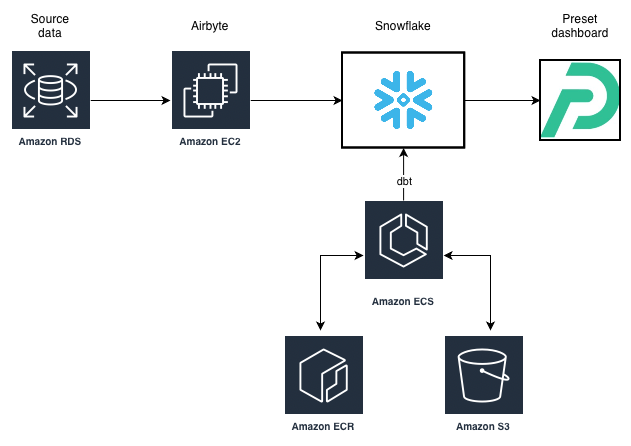
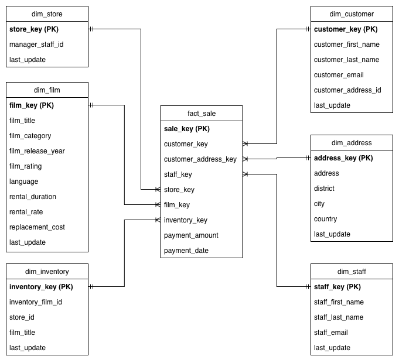
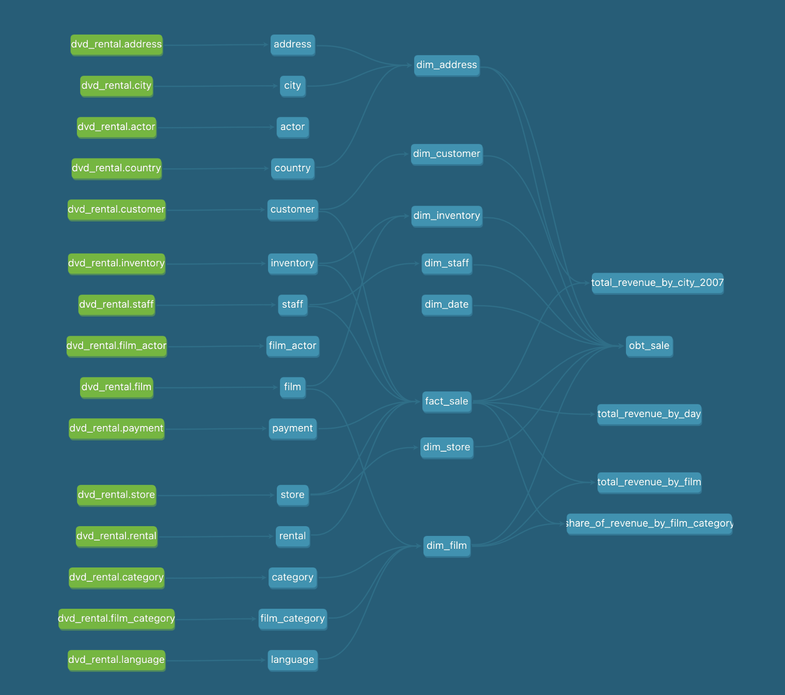

# big-data-processing-project

## Table of Contents
- [Introduction](#introduction)
- [Solution Architecture](#solution-architecture)
- [Project Components](#project-components)
    - [Generation](#generation)
    - [Ingestion](#ingestion)
    - [Storage](#storage)
    - [Transformation](#transformation)
    - [Serving](#serving)
- [Techniques used](#techniques-used)
- [Screenshots](#screenshots)

## Introduction
The aim of this project is to build an end-to-end data pipeline using Big Data processing technologies. The project uses data from a ficticious DVD rental store, and covers all stages of the Data Engineering Lifecycle: Generation, Ingestion, Storage, Transformation and Serving (including a dashboard). Snowflake was used as the data platform of choice.

Various data modelling techniques were used in order to answer the following business questions:
1. What is the total number of DVD rentals?
2. What is the average price a customer pays to rent a DVD?
3. What is the daily revenue over the last month?
4. Which film genres are most popular with our customers?
5. Which films are most popular with our customers?

## Solution Architecture

**Figure 1**: Solution architecture

## Project Components

### Generation 
- There was a single data source for this project: The DVD Rental dataset, hosted in nn Amazon RDS PostgreSQL instance. 
- This dataset contained 15 tables, modelled in 3NF.
- The dataset represented the various entities of a typical store e.g. `customer`, `order`, `address` etc

### Ingestion 
- Airbyte was the data integration tool used in this project, being hosted on an Amazon EC2 instance
- The data source was RDS, and the destination was Snowflake
- The Extract/Load pattern used was incremental CDC (Change Data Capture)

### Storage 
- Snowflake was used as the data warehouse in this project
- Airbyte inserted data into Snowflake with CDC timestamp columns

### Transformation 
- `dbt` was used to transform data within Snowflake
- `dbt` was hosted on ECS platform, and set to run daily using a Scheduled Task
- Medallion Architecture (Raw, Staging, Marts) was used for data layers
- Within marts layer, `dbt` was used to transform the data from 3NF into Star Schema (Kimball/Dimensional modelling)
- To aid reporting, an OBT model was also created in the marts layer

### Serving
- A Preset Dashboard was created to answer the business questions above
- Please see `screenshots` section of this `README` to see the dashboard

## Techniques used
The following tools / techniques were used in this project:
- Cloud deployment in AWS (ECS, EC2, IAM, RDS, S3 etc)
- Data Ingestion service (Airbyte)
- Incremental Extract using Change Data Capture (CDC)
- Various data transformations (window functions, joins, calculations etc)
- `dbt` used for data modelling/transformation
- Kimball/Dimensional modelling (Star Schema)
- One Big Table for BI Consumption
- Data quality tests
- Semantic modelling (metrics, calculated columns)
- Data visualisation (Preset dashboard)

## Screenshots

**Figure 2**: Kimball model for DVD dataset

**Figure 3**: `dbt` DAG for data warehouse
